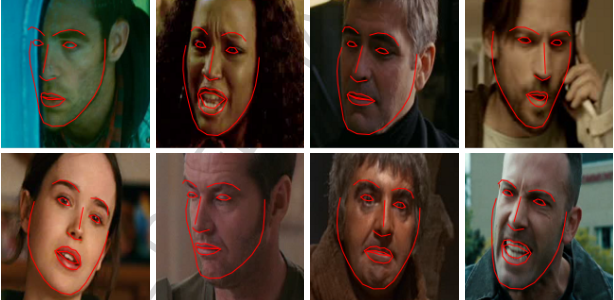
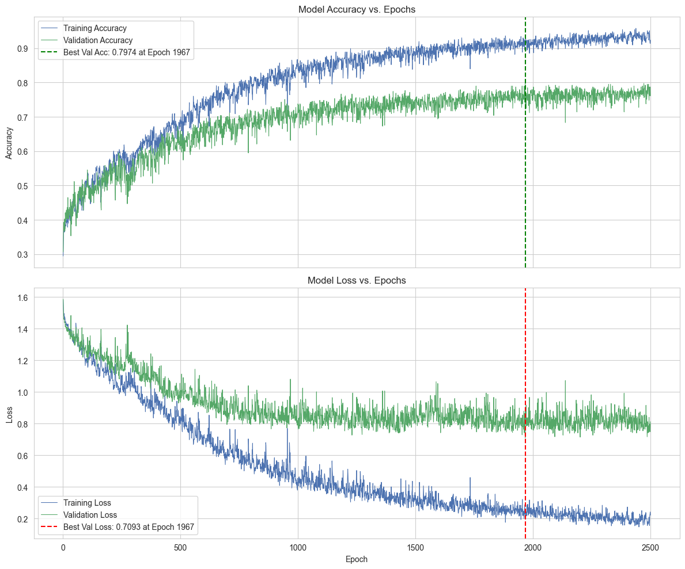
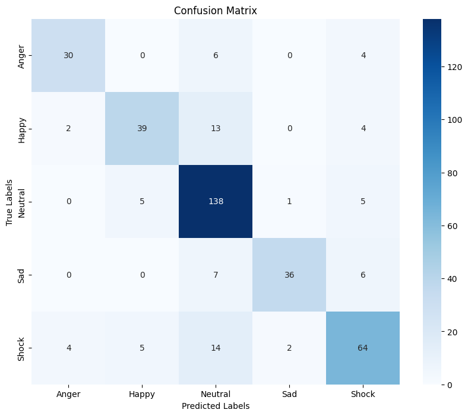

<h1 align="center"> 📹 End-to-End Video Emotion Recognition using MediaPipe and a CNN-LSTM Architecture 🤖 </h1>

<p align="center">
  
  
  
  
  
  
  
  
</p>

## 💡 Project Motivation & Demo

Traditional journaling relies on text, which can sometimes miss the full emotional context of a moment. This project explores a more intuitive and emotionally rich way to capture memories.

The core idea is a journaling application where a short, 3-5 second video clip serves as the "cover" for a daily entry. The deep learning model developed in this notebook automatically analyzes this video to classify the user's emotion, providing a quick, visual summary of their feelings on that day. This creates a more engaging and insightful journaling experience and opens up possibilities for tracking mood patterns over time for mental wellness.

<p align="center">
  
  <br>
  <em>*AI-generated illustration of the journaling app concept.* </em>
</p>

## ✨ Key Features

<p align="center">
  
</p>

* **Novel Emotion Labeling Pipeline**: Implements a unique workflow that successfully transforms the AFEW-VA dataset's continuous `valence` and `arousal` scores into five discrete emotion classes (`Anger`, `Happy`, `Shock`, `Neutral`, `Sad`) using K-Means clustering and manual curation.

* **Advanced Feature Extraction**: Utilizes MediaPipe Face Mesh to extract 468 3D facial landmarks per frame, creating a rich, high-dimensional feature set for the model.

* **Hybrid CNN-LSTM Architecture**: A custom PyTorch model (`EmotiMesh-Net`) that uses a 1D-CNN for spatial feature extraction from the landmark data and a bidirectional LSTM to learn temporal patterns from 15-frame video sequences.

* **Strong Final Performance**: Achieves a final validation accuracy of approximately 80% (79.74%), demonstrating the effectiveness of the end-to-end pipeline from raw data to a trained classifier.

* **Efficient & Parallelized Processing**: Employs multi-threading throughout the data pipeline (file copying, video generation, and data loading) for significant speed improvements on I/O-bound tasks.

## 📊 The AFEW-VA Dataset: A Closer Look

This project utilizes the **AFEW-VA dataset**, a specialized collection of videos designed for emotion estimation in challenging, real-world scenarios. Unlike datasets recorded in controlled lab settings, AFEW-VA features clips from movies with diverse environments, lighting, and head poses, making it an excellent benchmark for building robust models.

<p align="center">
  
  <br>
  <em>Example image from AFEW-VA.</em>
</p>

#### Key Characteristics
* **🎬 Content**: The dataset contains 600 video clips from feature films, selected for their challenging nature.
* **🏞️ Environment**: It features "in-the-wild" conditions with complex backgrounds, lighting, and head poses.
* **🏷️ Annotations**: Each frame is annotated with two types of labels:
    * Continuous `valence` (positive/negative) and `arousal` (calm/excited) scores on a -10 to 10 scale.
    * The coordinates of 68 facial landmarks.
* **✍️ Annotation Method**: A custom-built online tool was used for precise per-frame labeling by two collaborating, FACS-certified experts, ensuring high-quality ground truth.

#### Dataset Citation
The original paper for the dataset is cited below.

## 🚀 How to Run This Project

Follow these steps to set up the project on your local machine.

### 1. Prerequisites

* **Git**: To clone the repository.
* **Conda** or **Miniconda**: This is the recommended environment manager.
* *Alternatively*, you can use a local installation of **Python 3.11** and `pip`.

### 2. Clone the Repository

Open your terminal or command prompt and run the following commands:
```
git clone https://github.com/MuhRaflyArj/video-based-emotion-recognition.git
cd video-based-emotion-recognition
```

### 3. Set Up the Environment

You only need to follow **one** of the options below. Conda is recommended as it automatically handles the Python version and all dependencies.

**Option A: Using Conda (Recommended)**

1.  Create the Conda environment from the `environment.yml` file. This will install all necessary packages listed in the file.
    ```
    conda env create -f environment.yml
    ```
2.  Activate the newly created environment. The environment is named `pytorch12.8`.
    ```
    conda activate pytorch12.8
    ```

**Option B: Using pip and a Virtual Environment**

1.  Create a virtual environment. Make sure you are using Python 3.11.
    ```
    python -m venv venv
    ```
2.  Activate the virtual environment.
    * On Windows:
        ```
        .\\venv\\Scripts\\activate
        ```
    * On macOS/Linux:
        ```
        source venv/bin/activate
        ```
3.  Install the required packages using the `requirements.txt` file.
    ```
    pip install -r requirements.txt
    ```


## 🛠️ Tech Stack

This project leverages a range of powerful Python libraries for data processing, deep learning, and visualization.

### Core Language & Frameworks
* **Python**: The core programming language used for the project.
* **PyTorch**: The primary deep learning framework for building, training, and evaluating the `EmotiMesh-Net` model.
* **MediaPipe**: Used for its state-of-the-art Face Mesh solution to extract 468 3D facial landmarks from video frames.

### Data Processing & Analysis
* **NumPy**: For efficient numerical operations and handling the landmark coordinate arrays.
* **Pandas**: For reading and manipulating the sequential landmark data stored in CSV files within the custom PyTorch Dataset.
* **Scikit-learn**: Utilized for the K-Means clustering algorithm during the data labeling pipeline and for calculating final evaluation metrics like the classification report and confusion matrix.
* **OpenCV**: For video processing tasks, primarily converting the initial image sequences into `.mp4` files.

### Data Visualization
* **Matplotlib & Seaborn**: For creating all visualizations in the notebook, including the analysis of the valence-arousal space, clustering results, and final model performance charts.

### Utilities & Environment
* **Jupyter Notebook**: As the interactive development environment for building and documenting the project.
* **KaggleHub**: For programmatically downloading the AFEW-VA dataset.
* **Tqdm**: For creating informative progress bars to monitor long-running tasks like file copying and data processing.
* **Concurrent.futures**: For parallelizing I/O-bound tasks (file copying, video generation, data loading) to significantly improve performance.

## 📊 Performance & Results

After training is complete, the best-performing model is loaded and evaluated on the unseen validation set to assess its generalization capabilities.

The model achieves a strong **final validation accuracy of 79.74%** and a **weighted F1-score of 0.79**, demonstrating a solid predictive capability for classifying emotions from video sequences.

### 📈 Training History

The plots below show the model's accuracy and loss on both the training and validation sets over 2,500 epochs.



* ✅ **Successful Learning**: The curves clearly show that the model learned successfully over time, with accuracy consistently increasing and loss decreasing.

* 🎯 **Peak Performance**: The model achieved its best performance on the unseen validation data at **epoch 1967**, reaching a **peak accuracy of 79.74%**. This is the version of the model that was saved for the final evaluation.

* 🧐 **Generalization Gap**: A noticeable gap between the training (blue) and validation (green) curves indicates that the model fits the training data very well. This suggests some overfitting and presents an opportunity for further tuning to improve generalization.

### Performance by Emotion
The classification report provides a detailed look at the model's performance for each emotion class. The model shows excellent precision for `Sad` and exceptional recall for `Neutral`, though it finds `Happy` to be the most challenging class.

| Class | Precision | Recall | F1-Score |
| :--- | :---: | :---: | :---: |
| Anger | 0.83 | 0.75 | 0.79 |
| Happy | 0.80 | 0.67 | 0.73 |
| Neutral | 0.78 | 0.93 | 0.84 |
| Sad | 0.92 | 0.73 | 0.82 |
| Shock | 0.77 | 0.72 | 0.74 |
| **Weighted Avg** | **0.80** | **0.80** | **0.79** |

### Confusion Matrix
The confusion matrix visually confirms these patterns, with a strong diagonal indicating a high number of correct predictions. It also clearly shows that the most common errors occur when other emotions are misclassified as `Neutral`.

<p align="center">
  
</p>

### Analysis of Results
* **Key Strengths**: The model excels at identifying the `Neutral` class (93% recall) and is very precise when predicting `Sad` (92% precision).
* **Areas for Improvement**: The main challenge is the recognition of `Happy` expressions, which has the lowest recall (67%). The model also shows a tendency to misclassify other emotions as `Neutral`, likely due to the class imbalance in the dataset.

## 🔮 Future Work

Based on the results, the following steps could be taken to further improve the model:

* **Address Class Imbalance**: Implement techniques like oversampling the minority classes (e.g., `Anger`, `Sad`) or using a weighted loss function during training to give more importance to under-represented emotions.
* **Improve 'Happy' Recognition**: Augment the dataset with more diverse examples of `Happy` expressions or explore feature engineering techniques that better capture the subtle cues of a genuine smile.
* **Architectural Enhancements**: Experiment with adding an **Attention mechanism** to the LSTM to help the model focus on the most emotionally expressive frames within a sequence.
* **Deployment**: Package the final model into an API and integrate it into the front-end of the conceptual journaling application to complete the project's vision.

## 📜 Acknowledgements & Citation

This project would not have been possible without the high-quality AFEW-VA dataset. A special thanks to the authors for making their work publicly available to the research community.

### Dataset Citation
If you use this dataset, please cite the original paper:
```
@article{KOSSAIFI201723,
    title = {AFEW-VA database for valence and arousal estimation in-the-wild},
    journal = {Image and Vision Computing},
    volume = {65},
    pages = {23-36},
    year = {2017},
    note = {Multimodal Sentiment Analysis and Mining in the Wild Image and Vision Computing},
    issn = {0262-8856},
    doi = {https://doi.org/10.1016/j.imavis.2017.02.001},
    url = {https://www.sciencedirect.com/science/article/pii/S0262885617300379},
    author = {Jean Kossaifi and Georgios Tzimiropoulos and Sinisa Todorovic and Maja Pantic},
    keywords = {Continuous affect estimation in-the-wild, Dimensional affect recognition in-the-wild, Valence, Arousal, Facial expressions, Dimensional emotion modelling},
}
```