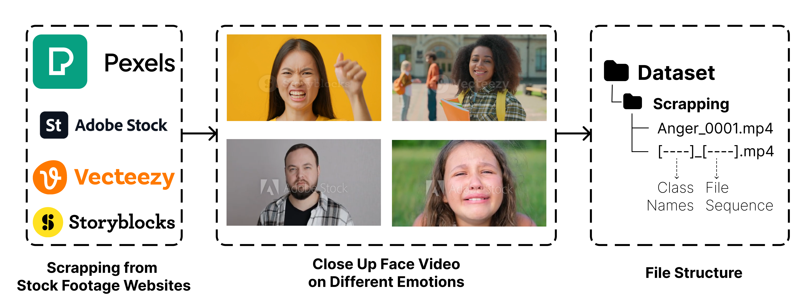

<h1 align="center"> 📹 End-to-End Video Emotion Recognition using MediaPipe and Pre-trained CNNs 🤖 </h1>

<p align="center">
  
  
  
  
  
  
  
  
</p>

## 💡 Project Motivation & Demo

Traditional journaling relies on text, which can sometimes miss the full emotional context of a moment. This project explores a more intuitive and emotionally rich way to capture memories.

The core idea is a journaling application where a short, 3-5 second video clip serves as the "cover" for a daily entry. The deep learning model developed in this notebook automatically analyzes this video to classify the user's emotion, providing a quick, visual summary of their feelings on that day. This creates a more engaging and insightful journaling experience and opens up possibilities for tracking mood patterns over time for mental wellness.

<p align="center">
  
  <br>
  <em>*AI-generated illustration of the journaling app concept.* </em>
</p>

## ✨ Key Features

<p align="center">
  
</p>

*   **Temporal Feature Stacking**: A novel feature engineering approach that samples frames from a video, crops the face, and stacks the grayscale images into a single multi-channel tensor. This captures both spatial and temporal information in a format suitable for 2D CNNs.
*   **Pre-trained CNNs for Feature Extraction**: Leverages powerful, pre-trained models like **EfficientNetV2** and **MobileNetV3** as the backbone. The first layer of each model is adapted to handle the multi-channel temporal input.
*   **Custom Scraped Dataset**: Utilizes a custom dataset of close-up face videos scraped from stock footage websites, providing a diverse set of high-quality emotional expressions.
*   **Data Augmentation**: Employs a robust data augmentation pipeline during training—including flips, affine transformations, and random erasing—to improve model generalization and prevent overfitting.
*   **Efficient & Parallelized Processing**: Employs multi-threading throughout the data pipeline for significant speed improvements on I/O-bound tasks.

## 📊 The Dataset: A Custom Collection

This project utilizes a custom-built dataset scraped from various stock footage websites like Pexels, Adobe Stock, Vecteezy, and Storyblocks. This approach allows for a high-quality, targeted collection of videos specifically showing close-up facial expressions for five emotion classes: `Anger`, `Happy`, `Shock`, `Neutral`, and `Sad`.

<p align="center">
  
  <br>
  <em>Overview of the data collection and file structure.</em>
</p>

#### Key Characteristics
*   **🎬 Content**: Close-up videos of individuals clearly expressing one of the five target emotions.
*   **🏷️ File Naming**: Videos are systematically named with their class and a sequence number (e.g., `Happy_0001.mp4`).
*   **📁 Structure**: All videos are organized within a single `Scrapping` directory, simplifying data management.

## 🚀 How to Run This Project

Follow these steps to set up the project on your local machine.

### 1. Prerequisites

*   **Git**: To clone the repository.
*   **Conda** or **Miniconda**: This is the recommended environment manager.
*   *Alternatively*, you can use a local installation of **Python 3.11** and `pip`.

### 2. Clone the Repository

Open your terminal or command prompt and run the following commands:
```
git clone https://github.com/MuhRaflyArj/video-based-emotion-recognition.git
cd video-based-emotion-recognition
git checkout video
```

### 3. Set Up the Environment

You only need to follow **one** of the options below. Conda is recommended as it automatically handles the Python version and all dependencies.

**Option A: Using Conda (Recommended)**

1.  Create the Conda environment from the `environment.yml` file. This will install all necessary packages listed in the file.
    ```
    conda env create -f environment.yml
    ```
2.  Activate the newly created environment. The environment is named `pytorch12.8`.
    ```
    conda activate pytorch12.8
    ```

**Option B: Using pip and a Virtual Environment**

1.  Create a virtual environment. Make sure you are using Python 3.11.
    ```
    python -m venv venv
    ```
2.  Activate the virtual environment.
    *   On Windows:
        ```
        .\\venv\\Scripts\\activate
        ```
    *   On macOS/Linux:
        ```
        source venv/bin/activate
        ```
3.  Install the required packages using the `requirements.txt` file.
    ```
    pip install -r requirements.txt
    ```

### 4. Set Up Environment Variables and Download Data

1.  Copy the example environment file:
    ```
    cp .env.example .env
    ```
2.  Open the `.env` file and set the `DATASET_DOWNLOAD_ID` to the Google Drive file ID of your dataset ZIP file.
3.  Run the training notebook, [`train_notebook.ipynb`](train_notebook.ipynb). The initial cells will automatically download and extract the dataset for you.

## 🛠️ Tech Stack

This project leverages a range of powerful Python libraries for data processing, deep learning, and visualization.

### Core Language & Frameworks
*   **Python**: The core programming language used for the project.
*   **PyTorch**: The primary deep learning framework for building, training, and evaluating the models.
*   **MediaPipe**: Used for its state-of-the-art Face Mesh solution to detect and crop faces from video frames.

### Data Processing & Analysis
*   **NumPy**: For efficient numerical operations.
*   **OpenCV**: For all video processing tasks, such as frame extraction and image manipulation.
*   **Tifffile**: For saving and loading the multi-channel image stacks used as model inputs.

### Utilities & Environment
*   **Jupyter Notebook**: As the interactive development environment for building and documenting the project.
*   **gdown**: For programmatically downloading the dataset from Google Drive.
*   **Tqdm**: For creating informative progress bars to monitor long-running tasks.
*   **Concurrent.futures**: For parallelizing I/O-bound tasks to significantly improve performance.

## 📊 Model Results & Conclusion

### Model Performance Summary

The table below summarizes the validation accuracy of each model (MobileNetV3-Large, EfficientNetV2-S, EfficientNetV2-M) across different image sampling intervals and channel lengths. The number of parameters for each model is shown below the model name.

| Image Interval | Channel Length | <div align="center">MobileNetV3Large<br>3.469 M params</div> | <div align="center">EfficientNetV2S<br>20.839 M params</div> | <div align="center">EfficientNetV2M<br>53.520 M params</div> |
|:--------------:|:--------------:|:----------------------------------------------------------:|:----------------------------------------------------------:|:----------------------------------------------------------:|
|       5        |       18       |64.13%                                                      |**85.87%**                                                  |82.61%                                                      |
|      10        |        9       |61.69%                                                      |**76.09%**                                                  |73.91%                                                      |
|      15        |        5       |77.17%                                                      |**79.35%**                                                  |73.91%                                                      |

#### 📝 **Result Summary**

- **EfficientNetV2-S** achieves the highest accuracy across all intervals, especially at interval 5 (85.87%), showing strong generalization and robustness.
- **EfficientNetV2-M** also performs well, slightly below EfficientNetV2-S, indicating that larger models do not always guarantee better results for this dataset.
- **MobileNetV3-Large** has the lowest parameter count and is fastest, but its accuracy is lower, especially at smaller intervals.
- **Shorter intervals (more channels)** generally improve performance for all models, likely due to richer temporal information.

#### 🔍 **Confusion Matrix Visualization**

The confusion matrices below illustrate how each model performs on the validation set for each image interval. Each matrix shows the number of correct and incorrect predictions for each emotion class. Darker diagonal cells indicate more correct predictions (higher recall), while off-diagonal cells reveal confusion between classes.

<p align="center">
  
</p>

**How to read:**  
- Each row represents the true emotion label, and each column represents the predicted label.
- High values on the diagonal (top-left to bottom-right) mean the model is correctly identifying that emotion.
- Off-diagonal values indicate misclassifications (e.g., confusing "Sad" with "Neutral").

---

### ✨ **Conclusion**

- **EfficientNetV2-S** is the best performer for this task, especially with more temporal channels (interval 5).
- All models show some confusion between similar emotions (e.g., "Sad" vs. "Neutral"), which is common in emotion recognition tasks.
- The confusion matrix helps identify which emotions are most challenging for the models, guiding future improvements.

**For best results, use EfficientNetV2-S with a small image interval (more channels)!** 🚀